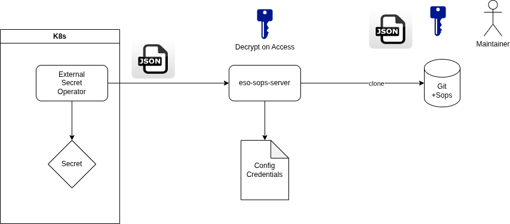

# Eso-sops-server

is a backend for External Secret Operator using the [Webhook Provider](https://external-secrets.io/latest/provider/webhook/).

## Overview

Secrets Files in Json Format can be stored save and encrypted in Git. 
For the encyrption [age](https://github.com/FiloSottile/age) in common with [SOps](https://github.com/getsops/sops) is used.

The server will clone the repo. Decryption of the secretfile on access.
The whole file file will be afterwards provided to ESO.

## Configuration

You must provide the Environment Variable CONFIG_PATH, pointing to the directory where 3 files are expected:

### config.yaml
Contains the global checkoutdir an the repos to be checked out
<pre>
repos:
   - name: sopstest
     url: https://github.com/hurzelpurzel/sopstest.git
     branch: "main"
checkout_dir: /workdir

</pre>

### git.yaml
User and token for all repos. Only one for all at present.
<pre>
git_user: "githubuser"
git_token: "pat"
</pre>

### users.yaml 
A simple user / role management is contained as well.
This list defines name / password for each user and the private age_key for decryption
<pre>
users:
  - name: admin
    password: admin
    age_key: "tbd"
    roles:
     - admin
     - user
  - name: other
    password: nop
    age_key: invalid
    roles:
     - invalid
</pre>

## Request Interfaces

Public accesible health endpoint: http://hostname:8080/healtz

Admin only init/clone of all repos : http://hostname:8080/init

User endpoint to get an decrypted json file. Reponame must match configured one. 
http://hostname:8080/git/reponame/filename.json

## Features
* Map a User it a age private key
* Support more then one Repository

## TODOS / Roadmap

* Enable TLS
* Let ESO Authenticate via User ( Integration Test )
* Support other Storage Backend ( s3 , provided PVC ) 